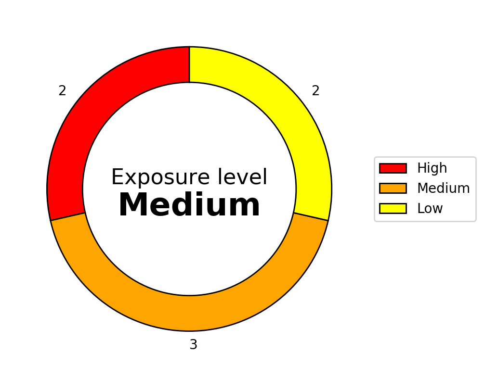

# Risk plot generator (rpg)

This tool takes a CSV file with your observations and outputs either a ring plot, or grid plot.

## Rationale

I was fed-up with having to manually create these graphs for a client and I wanted to make my life easier.
And since I want to increase my Python skills some more, this would be a fun little project to catch two birds with one stone.

## Usage

```
$ ./rpg.py -h
usage: rpg.py [-h] [-g] [-r] [-i INPUT_FILE] [-o OUTPUT_FILE]

Converting scanning reports to a tabular format

optional arguments:
  -h, --help            show this help message and exit
  -g, --grid            generate a risk grid.
  -r, --ring            generate a risk ring.
  -iC INPUT_CSV_FILE, --input-csv-file INPUT_CSV_FILE
                        specify an input CSV file (e.g. data.csv).
  -oP OUTPUT_PNG_FILE, --output-png-file OUTPUT_PNG_FILE
                        specify an output PNG file (e.g. risk.png).
```

## Example

To generate a risk grid: `$ ./rpg.py -iC example/input/data.csv -oP example/output/grid.png -g`


To generate a risk ring: `$ ./rpg.py -iC example/input/data.csv -oP example/output/ring.png -r`



## Dependencies

1. argparse (dev-python/argparse);
2. matplotlib (dev-python/matplotlib);
3. numpy (dev-python/numpy);
4. python (dev-lang/python).

## To do

1. Figure out a way to replace markers with numbers.
2. Figure out a way to plot markers without potentially overlapping.
   The randomise function still causes collisions when adding when plotting multiple markers in the same box.
